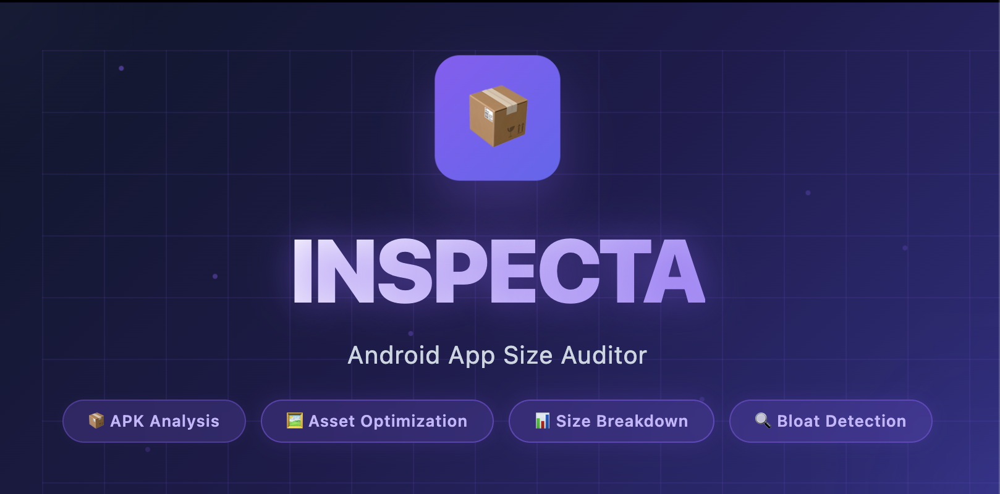

# 📦 Inspecta

<p align="center">
  
</p>

<p align="center">
  <strong>A powerful Gradle plugin for Android app size optimization and resource management</strong>
</p>

<p align="center">
  
  
  
  
</p>

---

## 🎯 What is Inspecta?

Inspecta is a comprehensive Gradle plugin designed to help Android developers understand, analyze, and optimize their app size. It scans your entire project, identifies unused resources, analyzes native libraries, detects unused dependencies, and provides actionable insights to reduce your APK/AAB size.

## ✨ Features

### 🔍 **Comprehensive App Analysis**
- **APK/AAB Size Breakdown** - Detailed composition analysis of your built artifacts
- **Multi-Module Support** - Scans all modules in your project automatically
- **Resource Detection** - Identifies PNGs, JPGs, WebPs, vector drawables, Lottie animations, and fonts
- **Native Library Analysis** - Deep dive into .so files and their impact on app size
- **Density Variant Detection** - Tracks image assets across different screen densities

### 🧹 **Smart Resource Cleanup**
- **Unused Resource Detection** - Finds resources not referenced in your codebase
- **Safe Deletion** - Dry-run mode to preview changes before applying
- **Type-Specific Cleanup** - Target specific resource types (PNG, JPG, WebP, SVG)
- **Bulk Operations** - Clean all unused resources at once

### 📚 **Dependency Management**
- **Version Catalog Analysis** - Detects unused dependencies in `libs.versions.toml`
- **Cross-Module Scanning** - Checks all modules for dependency usage
- **Cleanup Recommendations** - Suggests removable dependencies

### 💡 **Optimization Suggestions**
- WebP conversion recommendations
- App Bundle usage for ABI splits
- Large file optimization tips
- Unused resource removal strategies

---

## 🚀 Getting Started

### Installation

**1. Add the plugin to your project**

In your root `build.gradle.kts`:

```kotlin
plugins {
    id("org.plugin.inspecta") version "2.0.0" apply false
}
```

In your app module's `build.gradle.kts`:

```kotlin
plugins {
    id("org.plugin.inspecta") version "2.0.0"
}
```

**2. Sync your project**

```bash
./gradlew --refresh-dependencies
```

---

## 📖 Usage

### 🔍 Inspect Command

Analyze your app size and get detailed insights:

```bash
./gradlew inspect
```

**Output includes:**
- Total APK/AAB size with composition breakdown
- Image assets statistics (PNG, JPG, WebP, SVG)
- Native libraries analysis by architecture
- Unused resources detection
- Unused dependencies from version catalog
- Optimization recommendations

**Example Output:**

```
╔═══════════════════════════════════════════════════════════════════════════╗
║                                                                           ║
║                    📦  I N S P E C T A  —  v1.0                          ║
║                                                                           ║
║                         App Size Audit Report                            ║
║                                                                           ║
╚═══════════════════════════════════════════════════════════════════════════╝

🔍 Scanning 5 modules: app, core, coreUI, network, data

📱 App module detected: app

📊 SIZE BREAKDOWN
────────────────────────────────────────────────────────────────
✅ Built APK Found: app-release.apk
   Total Size: 45.2 MB (47,458,304 bytes)

   APK Composition:
   - Native Libs                   :   28.5 MB (63.1%)
   - Code (DEX)                    :   12.3 MB (27.2%)
   - Resources                     :    3.8 MB (8.4%)
   - Assets                        :    520 KB (1.1%)
   - Other (Manifest, Signatures)  :     90 KB (0.2%)
```

---

### 🧹 Cleanup Command

Remove unused resources from your project:

#### **Preview Mode (Safe - Default)**

Preview what will be deleted without making changes:

```bash
# Preview unused PNG files
./gradlew cleanupResources -Ptype=png

# Preview unused vector drawables
./gradlew cleanupResources -Ptype=svg

# Preview ALL unused resources
./gradlew cleanupResources -Ptype=all
```

#### **Delete Mode**

Actually remove the files:

```bash
# Delete unused PNG files
./gradlew cleanupResources -Ptype=png -Pconfirm=yes

# Delete unused JPG files
./gradlew cleanupResources -Ptype=jpg -Pconfirm=yes

# Delete ALL unused resources
./gradlew cleanupResources -Ptype=all -Pconfirm=yes
```

**Supported Resource Types:**

| Type | Description | Example |
|------|-------------|---------|
| `png` | PNG images | `ic_launcher.png` |
| `jpg` | JPEG images | `banner.jpg` |
| `webp` | WebP images | `hero.webp` |
| `svg` | Vector drawables | `ic_arrow.xml` |
| `all` | All image resources | - |

**Example Output:**

```
╔═══════════════════════════════════════════════════════════════════════════╗
║                                                                           ║
║                    🧹  INSPECTA  —  Resource Cleanup                      ║
║                                                                           ║
╚═══════════════════════════════════════════════════════════════════════════╝

🔍 Scanning 5 modules for unused resources...

📊 Found 14 unused PNG files
💾 Total size: 4.6 MB

   By type:
   • PNG: 14 files (4.6 MB)

📂 Breakdown by module:
   app: 9 files (3.2 MB)
   coreUI: 5 files (1.4 MB)

📄 Files to be removed (showing first 20):
   • app/src/main/res/drawable/ic_star_filled.png (2.5 KB)
   • app/src/main/res/drawable/ic_orange_payment_method.png (755 B)
   • core/coreUI/src/main/res/drawable/mascot_zero.png (954.4 KB)
   ...

🔍 DRY RUN MODE - No files were deleted

To actually delete these files, run:
   ./gradlew cleanupResources -Ptype=png -Pconfirm=yes

⚠️  Warning: This action cannot be undone!
   Make sure you have a backup or are using version control.
```
---

## 📝 License

```
Copyright 2025 Inspecta

Licensed under the Apache License, Version 2.0 (the "License");
you may not use this file except in compliance with the License.
You may obtain a copy of the License at

    http://www.apache.org/licenses/LICENSE-2.0

Unless required by applicable law or agreed to in writing, software
distributed under the License is distributed on an "AS IS" BASIS,
WITHOUT WARRANTIES OR CONDITIONS OF ANY KIND, either express or implied.
See the License for the specific language governing permissions and
limitations under the License.
```

---

## 📬 Support

- **Issues**: [GitHub Issues](https://github.com/yourusername/inspecta/issues)
- **Discussions**: [GitHub Discussions](https://github.com/yourusername/inspecta/discussions)

---

<p align="center">
  Made with ❤️ by Hossam Sadek
</p>

<p align="center">
  <strong>Star ⭐ this repo if Inspecta helped reduce your app size!</strong>
</p>
